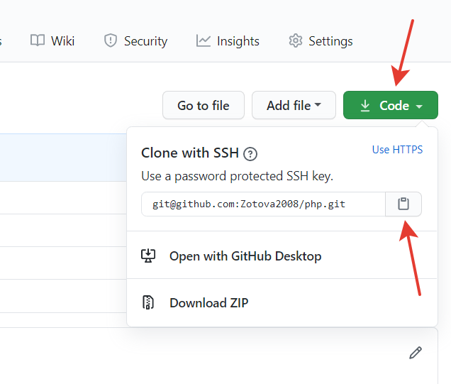

# Инструкция по работе с GIT

LICENSE: [MIT](license.md)


#### [<= К содержанию](../readme.md)

---

## git clone

---

**Если на GitHub уже есть проект:**

_Ваша команда или другой разработчик, уже начали проект. И он уже есть на GitHub. И вам нужно его скопировать и подключиться к этому репозиторию_

```
git clone git@github.com:Zotova2008/php.git
```



#### [<= К содержанию](../readme.md) | [далее - git pull =>](pull.md)
