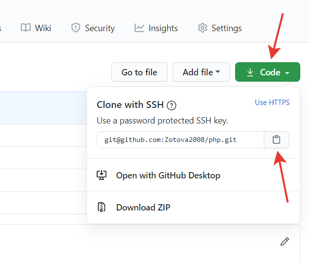

# Инструкция по работе с GIT

LICENSE: [MIT](license.md)


#### [<= К содержанию](../readme.md)

---

## git remote

---

**Если на GitHub у вас еще нет проекта:**

1. Переходим по https://github.com/new на GitHub

   _Если вы еще не авторизовались, то авторизуемся_

   _или_

   

2. **Заполняем и создаем.**


3. **Синхронизируем свою папку на компьютере с удаленным репозиторием**

```
git remote add origin git@github.com:Zotova2008/php.git
```



#### [<= К содержанию](../readme.md) | [далее - git pull =>](pull.md)
